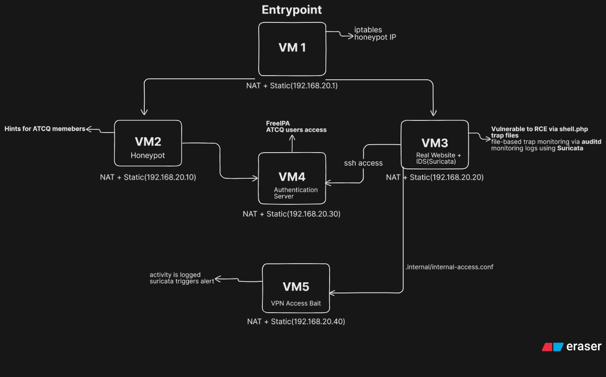

# Enterprise-Network-Security-Posture-Emulation

## Network System Security II – Blue Team vs Red Team Project

## Overview
This project was completed as part of the Network System Security II course. The objective was to design, defend, and attack a simulated enterprise network using layered security and deception techniques.

## Network Architecture
- 5 VMs: Entry Point, Honeypot, Real Web Server, Authentication Server, VPN Gateway
- Tools: iptables, Nginx, PHP, Suricata IDS, auditd, FreeIPA, WireGuard

## Blue Team(Us) Approach
- Deceptive firewall rules
- Honeypot with fake credentials and bait files
- Real server with controlled RCE vulnerability
- Suricata and auditd for trap monitoring

## Red Team Findings
- Discovered SSRF and SQL Injection vulnerabilities
- Social engineering via Instagram for flag retrieval
- Explored and bypassed firewall deception

## How to Run
- See [FINAL-REPORT-OF-NSS-PROJECT-1.pdf](/FINAL-REPORT-OF-NSS-PROJECT-1.pdf) for full setup and attack details.
- Scripts for mounting VM images and scanning are in `/scripts`.

## Lessons Learned
- Deception can slow attackers but not stop them
- Social media can be an unexpected attack vector
- Layered defense and monitoring are critical

## References
- [Final Report (PDF)](/FINAL-REPORT-OF-NSS-PROJECT-1.pdf)
- GeeksforGeeks: SSRF
- Suricata documentation
